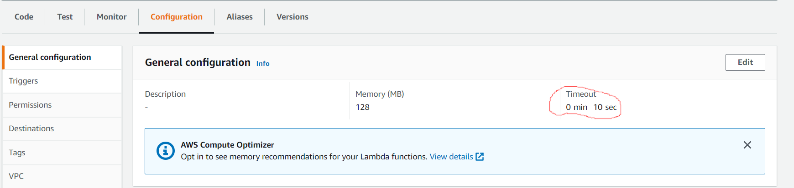
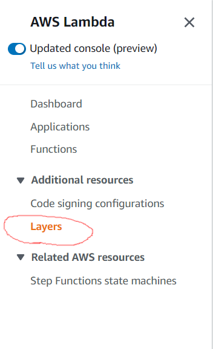

# Bruce Bot

Program that sends a message to a WIM slack channel containing the current day's featured holiday and a randomly chosen "WIM Quote". The
information is gathered from the "holidays20xx.json" and "BruceQuotes.txt" files, which should be uploaded to an AWS S3.

### Prerequisites

AWS account with access to S3, CloudWatch, and Lambda functions. 

```
Go to https://aws.amazon.com/ to setup
```

## Getting Started

To test this program on a local system, run the following command to install the required Node libraries:

```
npm install
```

To begin, create a Slack Bot (https://api.slack.com/apps) and create a Webhook for the specific Slack channel you want the message to go to 
(Under the "Incoming Webhooks" in the Features section). Take this URL and copy it into the 'webHookURL' constant at the beginning
of 'index.js' in this project. 

Next, go to your AWS S3 and create a new bucket (remember what you name the bucket), and upload the following
files to this bucket: all of the "holidays20xx.json" files, and "BruceQuotes.txt". Then, copy the name of your S3 bucket exactly into the
'bucketName' constant at the beginning of the 'index.js' file. 

The last two constants you will need to set are the 'AWSAccessKey' and
'AWSSecretKey' constants, which are used to access your S3. You can create a new access key and secret key
at https://console.aws.amazon.com/iam/home#/users. 

To see if everything works, run this:
```
node index.js
``` 
A message should be sent to the Slack channel that your Webhook URL is directed to. 

### Installing/Deploying onto a Lambda function

Begin by creating a new Lambda function (name is something like 'bruceBot' and for runTime use 'Node.js 12.x'). IMPORTANT: 
Under the 'Configuration' header for this function, make sure you edit the 'Timeout' option to at least 10 seconds.



Since this project is over 3MB when zipped, this built in code editor in Lambda will not display the files we need to change. To get around this,
we need to make a layer that includes all of the Node.js modules used. First, in a file explorer, select the 'node_modules' folder in this
project and zip this folder (Right click and Send to -> Compressed Zip Folder). Next, on the sidebar of the AWS Lambda, 
go to 'Layers' under the Additional Resources header.



Create a new Layer, name it 'node_modules', and upload the zip folder you just created (it should also be called 'node_modules').
Select 'Node.js 12.x' for a compatible runtime.

Back in the 'bruceBot' lambda function, scroll all the way down to the 'Layers' section and click Add a Layer. Then select Custom Layer,
and choose the 'node_modules' layer that we just created. We are now almost done: we just need to upload the actual script to the 
Lambda code section.

For this final step, in the lambda function Code Source viewer, delete the auto-created 'index.js' file. Next, in a File Explorer directed
to this project's directory, create a new folder (call it 'code') and copy the following files/folders from this project into that folder: 
the 'bin' folder and 'obj' folder (if these exist), 'package-lock.json', 'package.json', and 'index.js'. Now with this 'code' folder with all
of those files in it, create a zip folder. Back in the Code Source viewer, on the upper right hand side, use the 'Upload from' button to upload
the new 'code' zip folder. The last thing to do is to move all of these uploaded files (the 'bin' folder and 'obj' folder (if these exist), 'package-lock.json', 'package.json', 
and 'index.js') out of the 'code' folder in the Code Source environment file viewer, and move them so they are directly under
the base 'bruceBot' folder. This is so the function will be able to reach the index.js script. 

To make sure everything works, run a test of the function by clicking the 'Test' button and following the directions.

## Building and testing in AWS Lambda function (and using CloudWatch)

Inside the 'index.js' file, there are instructions to remove a section of code and replace it with a provided chunk that is currently
commented out (this should be easy to find, it's right at the top of the file). Follow those instructions inside the Lambda Code Source
viewer in your Lambda function so that the uploaded 'index.js' file will run the program upon receiving an event from AWS. 

If you want this function to run at certain times, it's helpful to use AWS CloudWatch. Go to https://console.aws.amazon.com/cloudwatch/home 
and under 'Events', create a New Rule. Select the 'Schedule' radio button, and click 'Add target', and select your lambda function. Under
the scheduler, you can choose to run the function at a fixed rate, or enter a CRON expression. (For example, the CRON expression to run
the script every weekday at 8:00AM is '0 14 ? * MON-FRI *'). Add this new Event and presto, your lambda function will run at the scheduled
times.

## Authors

* **[Kip Sullivan](https://github.com/KipSullivan)**  - *Volunteer Developer* - [USGS Web Informatics & Mapping](https://wim.usgs.gov/)

## License

This project is licensed under the Creative Commons CC0 1.0 Universal License - see the [LICENSE.md](LICENSE.md) file for details

## Suggested Citation
In the spirit of open source, please cite any re-use of the source code stored in this repository. Below is the suggested citation:

`This project contains code produced by the Web Informatics and Mapping (WIM) team at the United States Geological Survey (USGS). As a work of the United States Government, this project is in the public domain within the United States. https://wim.usgs.gov`


## Acknowledgments

* Based off the original idea of Hans Vraga
* Hat tip to anyone who's code was used
* Inspiration Note

## About WIM
* This project authored by the [USGS WIM team](https://wim.usgs.gov)
* WIM is a team of developers and technologists who build and manage tools, software, web services, and databases to support USGS science and other federal government cooperators.
* WIM is a part of the [Upper Midwest Water Science Center](https://www.usgs.gov/centers/wisconsin-water-science-center).
